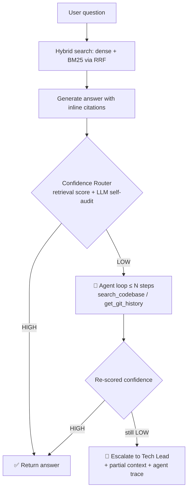

# 🧭 TraceAI (RepoScout)

An **agentic, hybrid Retrieval-Augmented Generation (RAG)** system that turns a large, unfamiliar codebase into answerable questions — built for Business Analysts, Product Owners, and Tech Leads who need to know *what* the code does and *where*, without reading it line by line.

Ask a question and TraceAI retrieves the most relevant code with a dense + sparse hybrid search over Qdrant, generates a grounded answer with inline file citations, and runs that answer through a **two-signal Confidence Router**. When confidence is low, instead of guessing — or escalating immediately — a bounded **agent loop** gives the model real tools (re-search the codebase, pull git history) to try to close the gap itself before falling back to a human Tech Lead.

---

## ⚡ Key Features

* 🎯 **Strict Directory Scoping** — tailored for modular monolithic frameworks (like Spryker eCommerce); a full-repo ingest restricts discovery to `src`, `vendor`, and `config`, pruning test directories and build caches automatically.
* 🧠 **Multi-Language, Structure-Aware Chunking** — LangChain's language-aware splitters partition `.php`, `.twig`, `.scss`, `.js`, `.py`, `.ts`, `.json`, `.md`, and `.xml` along syntactic boundaries instead of blind character windows.
* 🚀 **Hybrid Search with RRF** — fuses dense semantic vectors (`BAAI/bge-large-en-v1.5`) with Qdrant's native BM25 sparse vectors via Reciprocal Rank Fusion, so exact identifiers and semantic intent both surface relevant chunks.
* 🔗 **Git-Aware Attribution** — every indexed chunk is tagged with the commit, author, and date that actually wrote those lines, via one `git blame` pass per file and majority-vote attribution across the chunk's line range — not just "last commit to the file."
* 💾 **OOM-Safe Batched Ingestion** — generator-driven streaming with periodic flush + `gc.collect()` keeps memory flat regardless of repo size. Supports a full-repo rebuild *or* incremental upserts for a single file/folder without wiping the rest of the index.
* 🛡️ **Dual-Signal Confidence Router** — combines a retrieval-score heuristic (is the top match strong and well-separated from the rest?) with a second, independent LLM self-audit call (does the retrieved context actually support this answer?). Both must agree HIGH before an answer is trusted.
* 🤖 **Agentic Fallback Loop** — on a LOW-confidence first pass, a bounded ReAct-style loop (up to `AGENT_MAX_STEPS`) hands the model two tools — `search_codebase` (reformulate and re-search) and `get_git_history` (pull commit history for a file) — and lets it decide how to close the evidence gap before the system escalates to a human.
* 🌐 **FastAPI Service** — `/health`, `/ingest`, and `/ask` endpoints wrap the pipeline and query engine behind a real API, with a shared embedding model loaded once at startup instead of per-request.
* 📊 **Built-in Evaluation Harness** — a categorized, gold-answer eval set drives an aggregate Markdown report: pass rate overall and by category, Judge vs. Router confidence agreement, Precision@5/Recall@5 against known-relevant files, and agent-loop usage stats, regenerated on every run.

---

## 🏗️ How a Query Resolves



---

## 🛠️ Tech Stack

| Layer | Choice |
| --- | --- |
| Vector store | Qdrant — dense + sparse (BM25), fused via RRF |
| Embeddings | `sentence-transformers` — `BAAI/bge-large-en-v1.5` |
| Chunking | `langchain-text-splitters` (language-aware + JSON-aware) |
| Generation / Agent / Judge | Groq |
| API | FastAPI + Uvicorn |
| Git metadata | Shell `git log` / `git blame --line-porcelain` |

---

## 🚀 Getting Started

**1. Start Qdrant**
```bash
docker compose up -d
```

**2. Install dependencies**
```bash
pip install -r requirements.txt
```

**3. Configure environment** — create a `.env` file:
```env
# Required
GROQ_API_KEY=your_key_here

# Paths / storage
REPO_BASE_PATH=../TestRepo
QDRANT_URL=http://localhost:6333
COLLECTION_NAME=local_repo_chunks
DENSE_MODEL_NAME=BAAI/bge-large-en-v1.5
BATCH_SIZE=100
ENABLE_GIT_METADATA=true

# Confidence Router
RETRIEVAL_MIN_TOP_SCORE=0.35
RETRIEVAL_SCORE_GAP_THRESHOLD=0.15
ENABLE_LLM_CONFIDENCE_CHECK=true
TECH_LEAD_CONTACT=#eng-tech-leads on Teams

# Agent loop
ENABLE_AGENT_LOOP=true
AGENT_MAX_STEPS=3
```

**4. Ingest a codebase**
```bash
python ingest.py   # full repo at REPO_BASE_PATH — scoped to src/, vendor/, config/
```
Or, via the API, index a single file or folder without rebuilding everything else:
```bash
curl -X POST localhost:8000/ingest -H "Content-Type: application/json" \
  -d '{"path": "/abs/path/to/a/folder"}'
```

**5. Ask questions**

Through the API:
```bash
uvicorn app:app --reload
```
```bash
curl -X POST localhost:8000/ask -H "Content-Type: application/json" -d '{
  "questions": [
    {"id": "Q1", "type": "what_where", "question": "Where is the discount calculation for cart totals handled?"}
  ]
}'
```

Or straight from the CLI, no API needed:
```bash
python query_engine.py
```

---

## 📊 Evaluation

`eval_set.json` holds a hand-written, categorized gold-answer set (currently 3 categories × 5 questions: *Structural & Locational*, *Behavioral & Operational*, *Strategic & Contextual*). Running it drives every question through the full `ask()` pipeline — including the agent loop when it's triggered — then scores each answer with an independent LLM judge.

```bash
python eval_script.py
```

This regenerates `evaluation_results.md` with:

- **Overall pass rate**, plus a **breakdown by category**
- **Judge vs. Router confidence agreement** (HIGH/LOW counts for each)
- **Precision@5 / Recall@5** against each question's known-relevant files, when provided (matched by filename)
- **Evaluation health** — router escalations, judge failures, and total agent-loop steps taken across the run

The report intentionally contains aggregate metrics only, no raw per-question answers or judge JSON, so it stays safe to commit and quick to skim.

---

## ⚠️ Known Limitations

- Single LLM provider (Groq) — no Azure OpenAI / Bedrock fallback yet.
- Qdrant is containerized; the API/engine itself isn't yet (no app Dockerfile or CI pipeline).
- No retry/backoff around Groq calls — a rate-limited judge or generation call fails rather than retrying.
- Precision@5/Recall@5 match on filename only, not full path — fine for this dataset, but could register a false positive if two different files in the repo happen to share a name.
